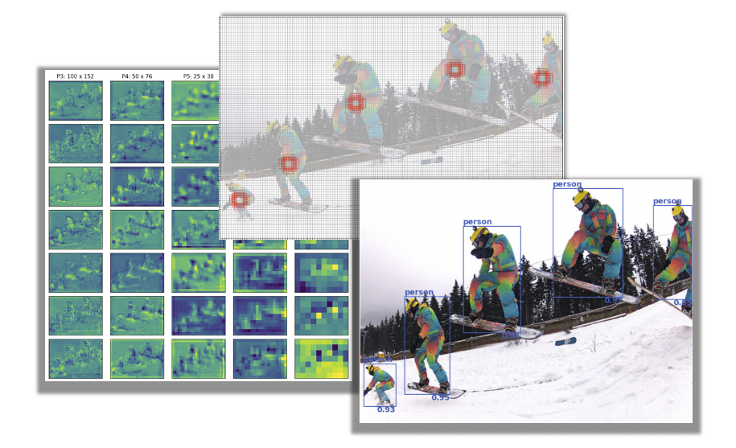

# Object Detection Inference: _Visualized_

This repository offers a blog-style Streamlit application to help visualize the inference workflow of a single-stage object detector. Specifically, we see how a pre-trained [RetinaNet](https://arxiv.org/abs/1708.02002) model processes an image to quickly and accurately detect objects, while also exploring fundamental object detection concepts along the way. 





## Repository Structure

```
.
├── cml                     # This folder contains scripts that facilitate the project launch on CML
├── app             				# Contains Streamlit application files
├── src											# A set of modules supporting the model, data, and visualizations
├── data                  	# Storage directory for data assets
├── images									# 
├── README.md               
└── requirements.txt        
```

